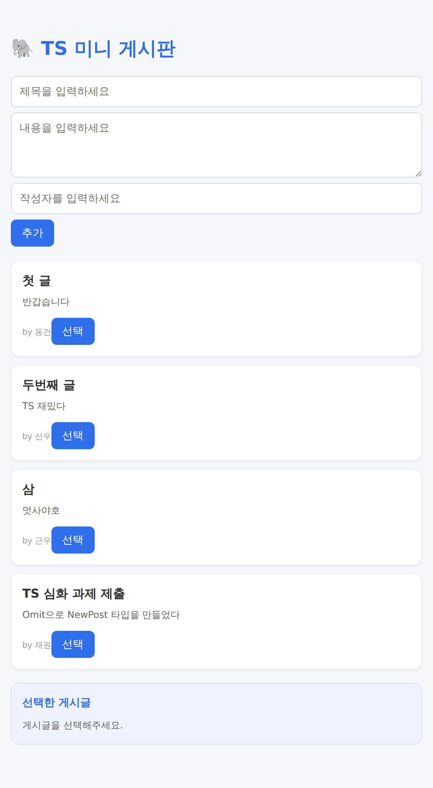
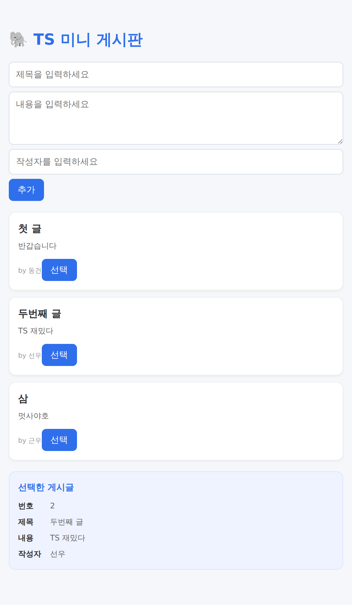
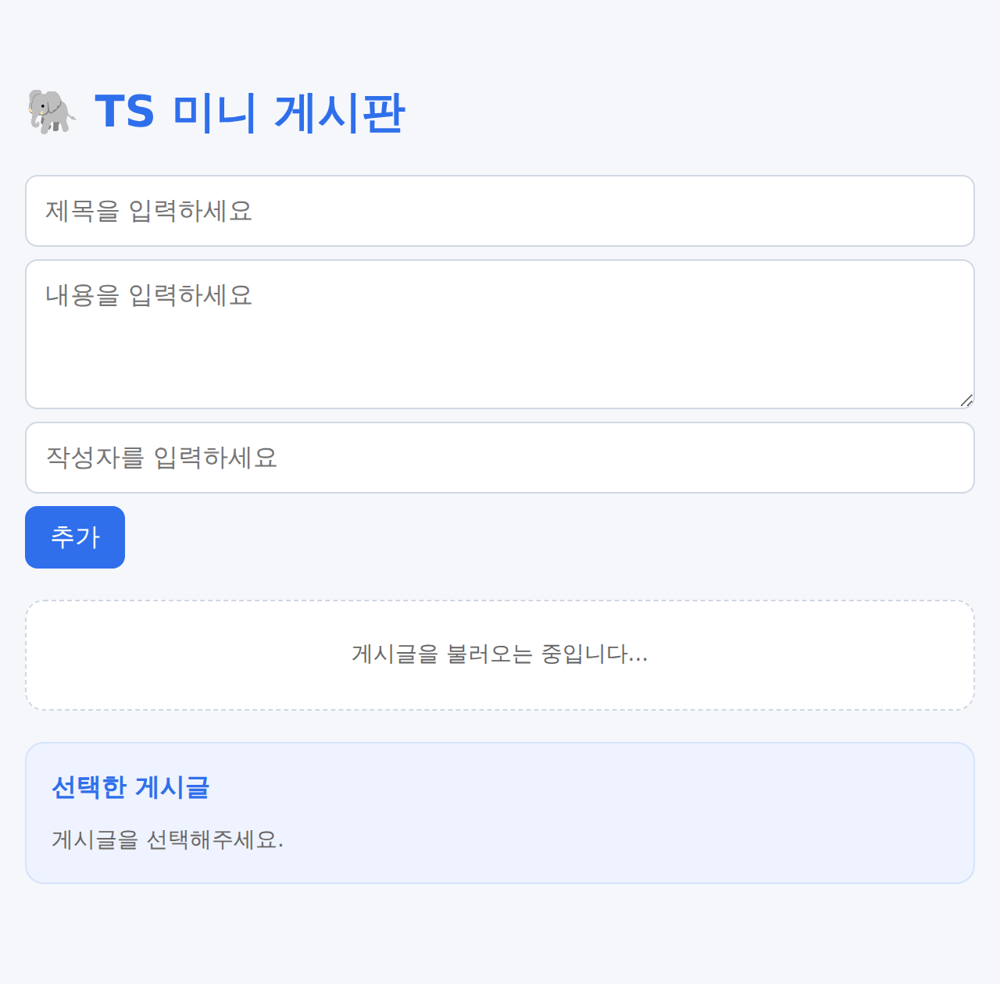
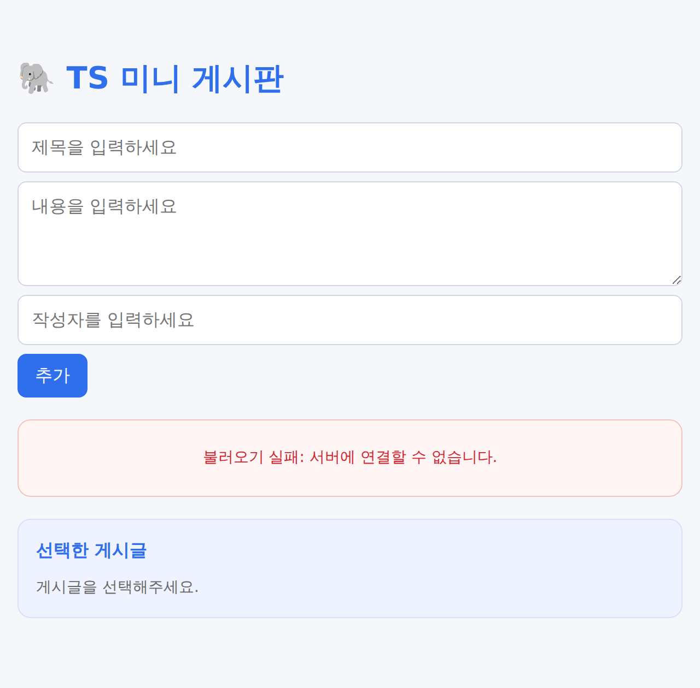

# TS-3rd-hw

멋쟁이사자처럼 14기 프론트엔드 · **TS 심화: 타입 설계** 세션 과제입니다.
[jjjung0921/ts-session](https://github.com/jjjung0921/ts-session) 스타터 코드를 기반으로, 미니 게시판에 유틸리티 타입 · 유니온 타입 좁히기 · 서로소 유니온을 적용했습니다.

## 실행 방법

```bash
pnpm install
pnpm dev     # 개발 서버
pnpm build   # 타입 검사(tsc -b) + 빌드
pnpm lint    # ESLint
```

## 구현 내용

### 과제 1 - 게시글 추가하기

- `useState<Post[]>(DUMMY)`로 게시글 목록을 상태로 관리하고, 목록은 상태 변수 `posts`로 렌더링합니다.
- `src/types.ts`에 `NewPost = Omit<Post, "id">`를 만들어 **저장 전 입력 데이터**와 **저장된 게시글**의 차이(`id` 유무)를 타입으로 표현했습니다.
- `추가` 버튼을 누르면 `trim()`한 값으로 `NewPost`를 먼저 만들고, 하나라도 비어 있으면 추가하지 않습니다.
- `{ id: Date.now(), ...newPost }`로 `Post`를 만든 뒤 `[...prevPosts, post]` 새 배열로 추가하고 입력창을 비웁니다.

### 과제 2 - 게시글 선택하기

- 선택한 게시글을 `useState<Post | null>(null)`로 관리합니다. (`null` = 아직 선택하지 않음)
- `PostItem`의 Props에 `onSelect: (post: Post) => void`를 추가해, `선택` 버튼을 누르면 현재 `post`를 넘깁니다.
- `selectedPost === null` 조건으로 타입을 좁힌 뒤에만 번호·제목·내용·작성자에 접근합니다. (`!`, `as`, `?.` 미사용)

### 과제 3 - 목록 화면 상태 나누기

- `src/types.ts`에 `status`로 구분하는 서로소 유니온 `PostListState`(`loading` / `success` / `error` / `empty`)를 만들었습니다. 선택적 프로퍼티(`?`)는 쓰지 않았습니다.
- `PostList`는 `status`를 먼저 확인해 로딩·실패·빈 화면을 반환하고, 남은 `success` 상태에서만 `data`로 `PostItem` 목록을 렌더링합니다.
- `App`에서는 `posts.length`에 따라 `success` 또는 `empty` 상태 객체(`PostListState` 타입)를 만들어 `PostList`에 넘깁니다.

## 과제 3 회고: `{ status: 'success', data: [] }`와 `empty`

`{ status: 'success', data: [] }`도 타입 검사를 통과하지만, `empty`가 "게시글이 없음"을 상태 자체로 표현해 안내 문구를 보여 주는 것과 달리 이 값은 "불러오기는 성공했는데 목록이 비어 있음"이 되어 `PostList`에서 카드도 안내 문구도 없는 빈 화면이 렌더링됩니다.
따라서 이 설계는 `loading`인데 `data`가 있거나 `error`인데 `data`가 있는 것 같은 모순된 조합은 막았지만, `Post[]`가 빈 배열도 허용하기 때문에 "게시글 0개"라는 같은 상황을 두 가지로 표현할 수 있어 불가능한 상태를 완전히 없앴다고 보기는 어렵습니다.
타입으로 막으려면 `data`를 `[Post, ...Post[]]`처럼 최소 1개를 보장하는 튜플 타입으로 바꿔, 빈 목록은 `empty`로만 표현되게 할 수 있습니다.

## 실행 화면

| 과제 1 · 게시글 추가 | 과제 2 · 두 번째 게시글 선택 |
| :---: | :---: |
|  |  |

과제 3 — 나머지 세 상태를 임시로 넘겨 확인한 화면 (성공 상태는 위 화면과 같습니다)

| loading | empty | error |
| :---: | :---: | :---: |
|  |  |  |

## 완료 조건 확인

코드를 일부러 바꿔서 타입 오류가 나는지 확인했습니다.

| 바꾼 코드 | TypeScript 오류 |
| --- | --- |
| 게시글 상태 초기값을 `['문자열']`로 변경 | `TS2322: Type 'string' is not assignable to type 'Post'.` |
| `NewPost` 객체에 `id` 추가 | `TS2353: Object literal may only specify known properties, and 'id' does not exist in type 'NewPost'.` |
| 조건문 없이 `selectedPost.title` 접근 | `TS18047: 'selectedPost' is possibly 'null'.` |
| `status` 확인 없이 `state.data` 접근 | `TS2339: Property 'data' does not exist on type 'PostListState'.` |

- 과제에서 작성한 코드에는 `any`와 타입 단언을 쓰지 않았고, 타입은 `import type`으로 가져왔습니다.
- `pnpm build`, `pnpm lint` 모두 통과합니다.
